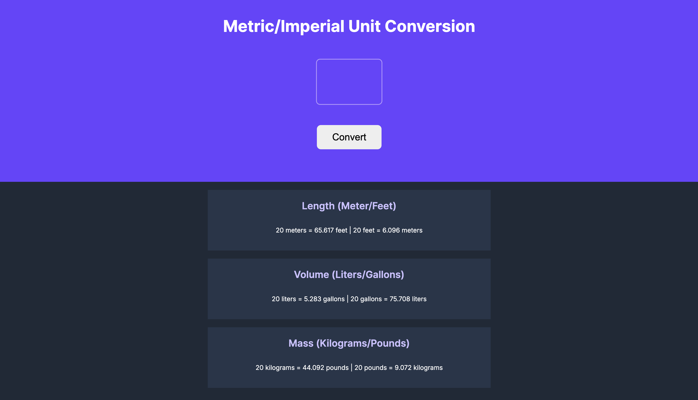

# Metric / Imperial Unit Converter

A simple unit conversion web app built with HTML, CSS, and JavaScript. Enter a number and instantly convert between metric and imperial units for length, volume, and mass.

## Live Demo

https://shwarzbergzelda.github.io/Unit-Converter/

## Preview

## Features

- Convert meters ↔ feet
- Convert liters ↔ gallons
- Convert kilograms ↔ pounds
- Clean and responsive user interface
- Input validation for empty values
- Results rounded to 3 decimal places

## Built With

- HTML5
- CSS3
- JavaScript (ES6)

## What I Learned

Through this project, I practiced:

- DOM manipulation
- Event listeners
- Working with number inputs
- Form validation
- JavaScript arithmetic and unit conversions
- String interpolation with template literals
- Flexbox layouts
- Deploying projects with GitHub Pages

## Conversion Rates

| Conversion | Rate |
|------------|------|
| Meters → Feet | 1 meter = 3.28084 feet |
| Liters → Gallons | 1 liter = 0.264172 gallons |
| Kilograms → Pounds | 1 kilogram = 2.20462 pounds |

## Future Improvements

- Add support for additional unit types
- Improve mobile responsiveness
- Add keyboard support (Enter key to convert)
- Add copy-to-clipboard functionality for results
- Add conversion history

## Author

**Zelda Shwarzberg**

GitHub: https://github.com/shwarzbergzelda
